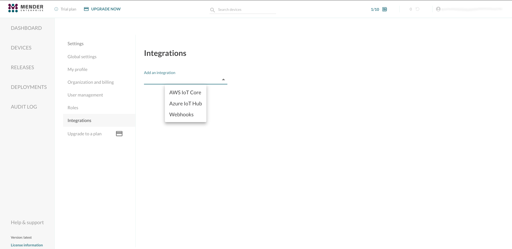
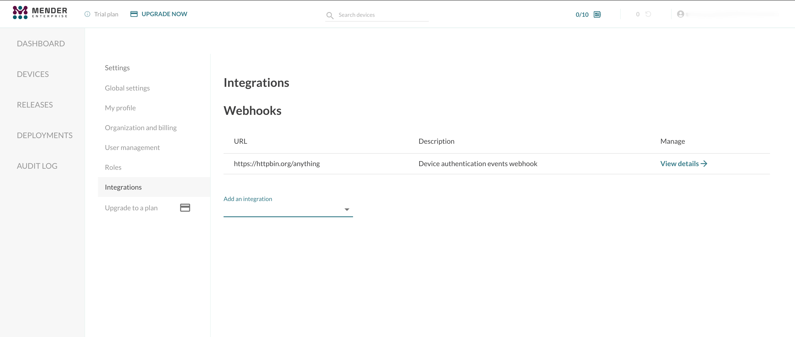
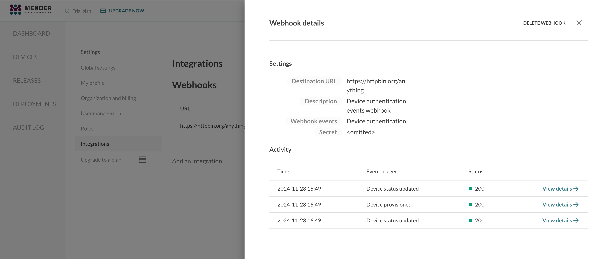
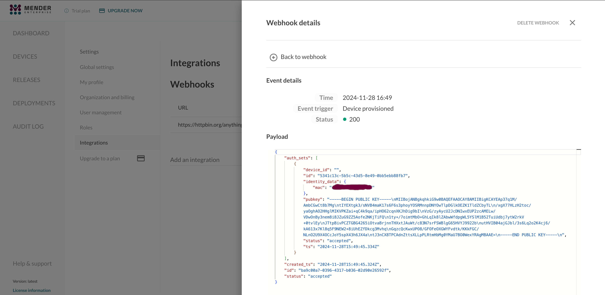

!!!!! Inventory type Webhooks are only available in the Mender Professional
!!!!! and Enterprise plans, while Device auth type Webhooks is available
!!!!! in all plans.
!!!!! See [the Mender plans page](https://mender.io/pricing/plans?target=_blank)
!!!!! for an overview of all Mender plans and features.

Mender supports Webhooks to send data to third-party systems. With this mechanism, it's possible
to notify external applications about device lifecycle and inventory changed events.
This eliminates the need for manual polling and synchronization, allowing for efficient
handling of device-related events as well as advanced integration possibilities.

We divided webhook integrations into two categories (_scopes_): `deviceauth` and `inventory`.
The former is available in all Mender [plans](https://mender.io/pricing/plans), as well as Mender Open Source,
while `inventory` webhook integration requires Mender Professional plan or higher.

## Prerequisites

### A Mender Server and device

You need a device integrated with Mender, see the [Get started guide](../../01.Get-started/01.Preparation/01.Prepare-a-Raspberry-Pi-device/docs.md).

### External service

To receive data from the Mender Server, you'll need an internet-accessible service
or application that can accept HTTP POST requests. The service's domain
name must resolve to a publicly accessible unicast IP address. For security,
we recommend using HTTPS and setting up a secret for verifying
request authenticity (see [below](#signature-header)).

## Supported events

### Device lifecycle (deviceauth) triggers

A webhook in the `deviceauth` scope fires on device lifecycle events:
* device provisioning,
* device decommissioning, or
* its authentication status changes.

### Inventory changed triggers

A webhook in the `inventory` scope fires whenever Mender Server detects
inventory change by a device and updates the device's inventory information.


## Configure and enable Webhooks in Mender

To send data from Mender to your application, you need to set up the integration by providing
a unique URL and an optional secret.

Open the Mender UI and navigate to `Settings` -> `Integrations`:



Choose the `Webhooks` integration and enter your application URL and necessary credentials (optional):


After creating the Webhooks integration, you will see it in the integrations list.



You can see details of a given Webhook integration after proceeding to its details:



You can also see the Webhooks activity in the `Activity` tab:


And further details after clicking `View details` on ant event row:



## Events details

The event data sent to your application, depending on the event type, may look like this:

```json
{
  "id": "e57adf60-5d8c-4c66-802a-e0c5f643102a",
  "type": "device-status-changed",
  "data": {
    "id": "769e5a83-259c-4506-ab05-9c2564f196fd",
    "status": "accepted"
  },
  "time": "2022-09-13T10:03:47.746805235Z"
}
```

The list of allowed event types follows:
* `device-provisioned`
* `device-decommissioned`
* `device-status-changed`
* `devices-inventory-changed`

The device authentication event consists of the following fields:
* `id` - device unique ID,
* `status` - the authentication status of the device,
* `auth_sets` - array of device authentication sets,
* `created_ts` - the time the device was initialized in Mender.

The properties included depend on the event type:
* device provisioning includes the entire device with the accepted authentication set, 
* status change events only include the device id and the new status, 
* device decommissioning will only include the device id.

The inventory changed event looks as follows:

<!-- AUTOMATION: ignore=`inline json data not subject to autoversion` -->
<!--AUTOVERSION: "\"value\": \"%\""/ignore-->
```json
{
  "id": "1aaf5222-8f2c-4d48-9ae9-8862e78c3fdf",
  "type": "devices-inventory-changed",
  "data": {
    "device_id": "1c251e63-ca93-41e2-ae39-97f402d93dd3",
    "tenant_id": "66ff8a4650829de3d99a25f1",
    "inventory": [
      {
        "name": "artifact_name",
        "value": "large",
        "scope": "inventory"
      },
      {
        "name": "cpu_model",
        "value": "ARMv7 Processor rev 3 (v7l)",
        "scope": "inventory"
      },
      {
        "name": "device_type",
        "value": "raspberrypi4",
        "scope": "inventory"
      },
      {
        "name": "hostname",
        "value": "raspberrypi",
        "scope": "inventory"
      },
      {
        "name": "ipv4_wlan0",
        "value": "10.0.0.1/24",
        "scope": "inventory"
      },
      {
        "name": "kernel",
        "value": "Linux",
        "scope": "inventory"
      },
      {
        "name": "mac_eth0",
        "value": "01:01:01:01:01:01",
        "scope": "inventory"
      },
      {
        "name": "mender_bootloader_integration",
        "value": "uboot",
        "scope": "inventory"
      },
      {
        "name": "mender_client_version",
        "value": "4.0.4",
        "scope": "inventory"
      },
      {
        "name": "network_interfaces",
        "value": [
          "eth0"
        ],
        "scope": "inventory"
      },
      {
        "name": "os",
        "value": [
          "RelaxedOS",
          "Based GNU/Linux 11 (bullseye)"
        ],
        "scope": "inventory"
      },
      {
        "name": "rootfs-image.checksum",
        "value": "dc51b8c96c2d745df3bd5590d990230a482fd247123599548e0632fdbf97fc22",
        "scope": "inventory"
      },
      {
        "name": "rootfs-image.large.version",
        "value": "1.0.0",
        "scope": "inventory"
      },
      {
        "name": "rootfs-image.version",
        "value": "2023-05-03-raspios-bullseye-armhf-lite-mender",
        "scope": "inventory"
      },
      {
        "name": "rootfs_type",
        "value": "ext4",
        "scope": "inventory"
      },
      {
        "name": "update_modules",
        "value": [
          "deb",
          "directory",
          "docker",
          "mender-configure",
          "rootfs-image",
          "rpm",
          "script",
          "single-file"
        ],
        "scope": "inventory"
      }
    ]
  },
  "time": "2024-10-04T08:13:03.570584412Z"
}
```

More information about payload possibilities are available
in the [iot-manager](https://github.com/mendersoftware/iot-manager) management API specification.

## Signature header

If you specify a secret, an integrity check is calculated and located in the `X-Men-Signature` header,
which contains the HMAC-SHA256 of the payload using the configured secret.

## Role Based Access Control

!!!!! Role Based Access Control is only available in the Mender Enterprise plan.
!!!!! See [the Mender plans page](https://mender.io/pricing/plans?target=_blank)
!!!!! for an overview of all Mender plans and features.

*Admin* permission is required to set up the integration.
