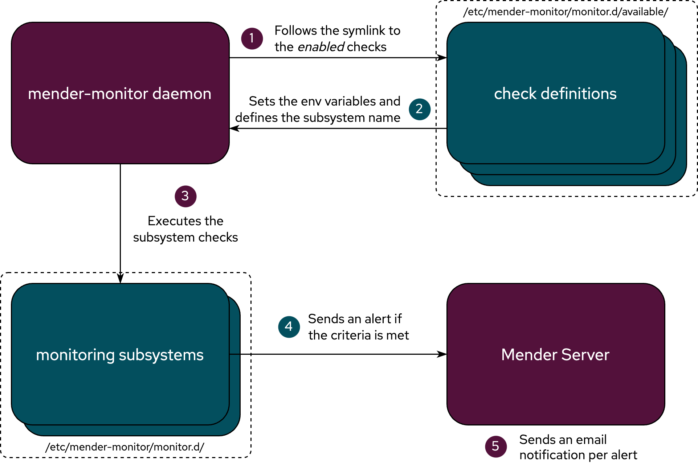

!!!!! Requires the Mender Monitor add-on package.
!!!!! See [the Mender features page](https://mender.io/product/features?target=_blank)
!!!!! for an overview of all Mender plans and features.

The Mender Monitor add-on gives you instant visibility into issues
with your device fleet. In addition, it allows you to customize the alert's checks
when certain parts of your infrastructure malfunction or need your attention.

To save bandwidth and support edge processing, Monitor is a fully
distributed solution, meaning that we send no data from the device
to the server unless triggered by an alert's check. Compared to classic approaches
of sending all the data about all the nodes to the server all the time,
this leads to massive bandwidth savings and allows instant local processing.

## Alerts

Each time a systemd service is not running, a log file contains a given pattern,
or a signal is received on a given D-Bus bus, an email containing the alert is sent to
all users who have access to the Mender Server and the given device.
You can mute these email notifications in the Mender Server settings.

<!-- There is one exception to the above rule: if a systemd service goes up and down often
enough we consider it to be _flapping_. When `mender-monitor` detects this, the [systemd 
service monitoring subsystem](20.Monitoring-subsystems/docs.md#service) sends a _flapping alert_ 
and does not send anything else until the number of the systemd service state changes per one 
`FLAPPING_INTERVAL` goes below `FLAPPING_COUNT_THRESHOLD`. See the 
[advanced configuration](30.Advanced-configuration/docs.md) chapter for more information 
about these settings. -->

## Architecture

The Monitor add-on consists of two main parts:

- The API to the backend Mender Server that allows
you to integrate with existing solutions.
- The `mender-monitor` systemd service that performs the subsystems checks on the devices.

The `mender-monitor` service executes the monitoring subsystem's checks for particular events.
Then,the monitoring subsystem sends alerts to the Mender Server if the conditions are met. As
shown in the diagram below.



These alerts are also accessible via the Mender UI by clicking `DEVICES` on the left panel,
then choosing a device, and tap the `Monitoring` tab.

If you need more control, or you want to customize your monitoring solution, you can use
the set of bash functions (`/usr/share/mender-monitor/lib/`) that compose the service by
calling them directly from your scripts.

### Running and configuring

To start the `mender-monitor` daemon, run the following command:

```bash
systemctl start mender-monitor
```

You can view the `mender-monitor` service's logs running the following command:

```bash
journalctl -u mender-monitor
```

To configure the `mender-monitor` service, see the 
[advanced configuration](30.Advanced-configuration/docs.md) chapter for more
information about the available configuration.
